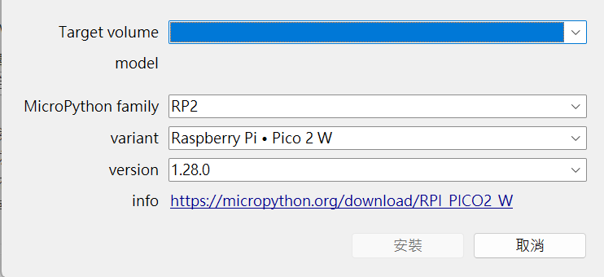

## 安裝 Tonny IDE

### 1. 下載 Tonny IDE

進入 [Tohhy 官方網站](https://thonny.org/)，選擇對應的作業系統下載「Portable variant」版本.

### 2. 解壓縮下載的檔案

注意勿解壓到有其他資料的資料夾內。

### 3. 開啟 Tonny IDE

選擇 `thonny.exe` 開啟程式，若出現防火牆警告，請選擇「允許存取」。  
首次使用可選擇顯示語言，可選擇「繁體中文(台灣)」或「English」。

## 初始化 Pico 2 W

將 Pico 2 W 透過 USB 線連接到電腦(優先選擇白色的 USB 口)後，在 Thonny 選擇「執行」→「設定直譯器」。  
在「直譯器」標籤頁中，選擇「MicroPython (Raspberry Pi Pico)」，並在右下角「安裝或是更新 MicroPython」。

import { Tabs, TabItem } from "@astrojs/starlight/components";

<Tabs>
  <TabItem label="文字說明">
  
    |               項目 | 選項                  |
    | -----------------: | :-------------------- |
    | MicroPython family | RP2                   |
    |            variant | Raspberry Pi．Pico 2W |
    |            version | 1.28.0                |
  
  </TabItem>
  <TabItem label="圖片示例">

    

  </TabItem>
</Tabs>

## 點亮內建 LED

```python
// led_0.py
from machine import Pin
from time import sleep

led = Pin("LED", Pin.OUT)
while True:
    led.toggle()
    sleep(1)
```
